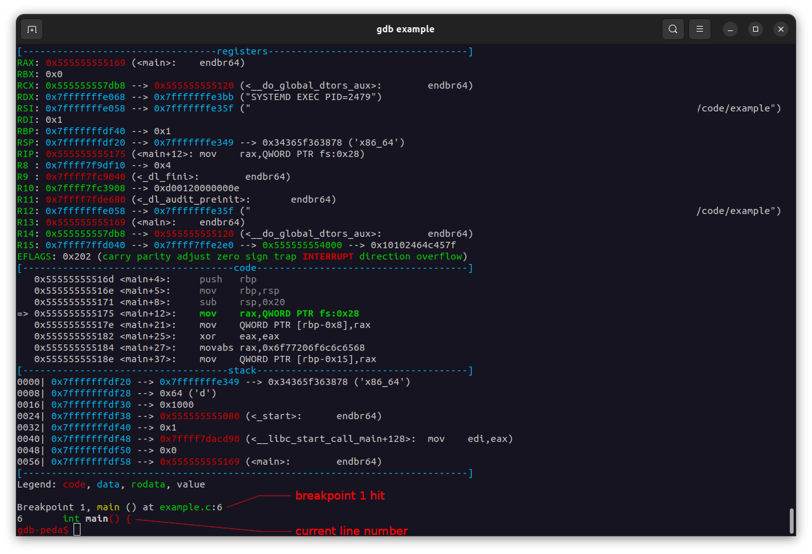

# Debugging C code with gdb

## Intro

I searched around for a step-by-step tutorial on how to debug c programs like this but could not find one. As a newcomer, starting to learn c, I found a lot of this information is scattered and/or buried in docs so I thought for my first blogpost to make a tutorial to help other new c users when they reach the issues I faced. If you would like to read more, the entire GDB manual can be found [here](https://ftp.gnu.org/old-gnu/Manuals/gdb/html_node/gdb_toc.html).

I have also aggregated a list of notes I have taken after learning and using gdb for a little over a year. These are at the [end](#other_useful_info) of the tutorial.

## Tools i used
gdb (https://www.sourceware.org/gdb/)
Peda (https://github.com/longld/peda) - not completely necessary for this tutorial but useful for looking at memory. 

## Tutorial

### A simple C program

I wrote a simple program that prints "hello world" character-by-character. This is what I will be using for the tutorial.

```c
// example.c

#include <stdio.h>
#include <stdlib.h>

int main() {
    char str[] = "hello world\n";

    int str_length = sizeof (str) / sizeof (char);

    for (int i=0; i < str_length; i++) {
        printf("%c", str[i]);
    }

    return 0;
}
```

### Compile binary

When debugging, compile your code with the `-g` flag. From gcc's man page `-g` will: "Produce debugging information in the operating system's native format (stabs, COFF, XCOFF, or DWARF).  GDB can work with this debugging information." There are also a few other [different versions](https://gcc.gnu.org/onlinedocs/gcc/Debugging-Options.html) of the `-g` flag. 

Compile example.c using the flag.

```sh
$ gcc -g example.c -o example
$ ls
example example.c
$ ./example
hello world
$ 
```

## Starting gdb

To start GDB:

```
$ gdb example
```

We are presented with the gdb-peda cli:
```
gdb-peda$
```

### Basic functions

GDB commands have shortcuts, most of which can be found online. You can start off by typing out entire commands but you will probably end up using these simple shortcuts. A couple of the main ones to remember are:

`r`: `run`  
`s`: `step` 1 line of code  
`si`: `step into` - step into functions  
`n`: `next` - will execute functions  
`ni`: `next` (assembly) `instruction`  
`c`: `continue` execution until the next breakpoint  
`q`: `quit` GDB  

Also, pressing `ENTER` without typing a command is the same as typing the previous command again.

### Breakpoints

To set a breakpoint, use `break` or `b` and the function you would like to break on. For example, to break when we enter the `main()` function in our exmaple code, we would type:

```
gdb-peda$ b main
Breakpoint 1 at 0x1175: file example.c, line 6.
gdb-peda$
```

Let's also set a breakpoint at a certain line number in our file. Here is our file again with line numbers:

```c
cat -n example.c
     1	// example.c
     2	
     3	#include <stdio.h>
     4	#include <stdlib.h>
     5	
     6	int main() {
     7	    char str[] = "hello world\n";
     8	
     9	    int str_length = sizeof (str) / sizeof (char);
    10	
    11	    for (int i=0; i < str_length; i++) {
    12	        printf("%c", str[i]);
    13	    }
    14	
    15	    return 0;
    16	
    17	}
```

To set a breakpoint at line 9:
```
gdb-peda$ b example.c:9
Breakpoint 2 at 0x119d: file example.c, line 9.
gdb-peda$ 
```

### Running the program 

Now run the program using `r`. Some errors may appear but it's ok.
```
gdb-peda$ r
Starting program: /debugging_c/example 
[Thread debugging using libthread_db enabled]
Using host libthread_db library "/lib/x86_64-linux-gnu/libthread_db.so.1".
Warning: 'set logging off', an alias for the command 'set logging enabled', is deprecated.
Use 'set logging enabled off'.

Warning: 'set logging on', an alias for the command 'set logging enabled', is deprecated.
Use 'set logging enabled on'.
```



Screenshot 1: Here is our program running in GDB. Peda gives us a nice view of the registers, the assembly code being executed, and the stack. Below that, we can see that we have hit our first breakpoint, line 6, the entry to our `main()` function. 


Let's continue execution:

```
gdb-peda$ c
```


Screenshot 2: We have now hit breakpoint 2 - line 9 in example.c

Let's return to our source file:

```c
cat -n example.c
     1	// example.c
     2	
     3	#include <stdio.h>
     4	#include <stdlib.h>
     5	
     6	int main() {                                            // <- Breakpoint 1
     7	    char str[] = "hello world\n";
     8	
     9	    int str_length = sizeof (str) / sizeof (char);      // <- Breakpoint 2 (we are here)
    10	
    11	    for (int i=0; i < str_length; i++) {
    12	        printf("%c", str[i]);
    13	    }
    14	
    15	    return 0;
    16	
    17	}
```

In Screenshot 2, we see the line `9  int str_length = sizeof (str) / sizeof (char);`. This is the next process to be executed. We can display this by using `print` or `p` to show the value of a variable. 

```sh
gdb-peda$ p str_length
$1 = 0x7fff //              <- ??
```

Step 1 line and print the variable again.

```sh
gdb-peda$ s
Legend: code, data, rodata, value
11	    for (int i=0; i < str_length; i++) {
gdb-peda$ p str_length
$2 = 0xd
gdb-peda$ 
```

Even though `hello world\n` is 12 characters, there is also the null character `\0` that indicates the end of the string.

You can also give the print command a format.
```sh
gdb-peda$ p/d str_length
$3 = 13
```

You may have noticed that the print command is also giving us variables. We can use these if we need to do a quick calculation. This is very useful when messing with addresses later on.

```sh
gdb-peda$ p $3+1
$4 = 0xe
gdb-peda$ p/d $4+1
$5 = 15
gdb-peda$ p/a &str_length           // 👀
$6 = 0x7fffffffdf24
```


## <a name="other_useful_info"></a>Other useful info: 

I have also been learning how to use gdb in cybersecurity courses. It is useful when learning buffer overflow and format string vulnerabilities. Here are some other things I have found useful enough to include in my notes. 

### Setting Arguments

I was using [this method](https://web.eecs.umich.edu/~sugih/pointers/gdbQS.html#:~:text=To%20execute%20one%20line%20of,next%22%20or%20%22n%22) for setting arguments for a while. However, I just learned that you can also put the arguments after `r`:

args.c
```c
#include <stdio.h>
#include <stdlib.h>

// tries to convert the first argument to an int and prints it
int main (int argc, char *argv[]) {
	if (argc <= 1) {
		printf("exiting ...\n");
		exit(1);
	}
	int arg1 = atol(argv[1]);
	printf("The number: %d\n", arg1);
	return 0;
}
```

```
$ gcc -g args.c -o args
$ ./args
exiting ...
$ ./args 42
The number: 42
```

In GDB, we can run the program with args:

```
gdb-peda$ r 5
Starting program: /code/args 5
[Thread debugging using libthread_db enabled]
Using host libthread_db library "/lib/x86_64-linux-gnu/libthread_db.so.1".
The number: 5
[Inferior 1 (process 40489) exited normally]
Warning: 'set logging off', an alias for the command 'set logging enabled', is deprecated.
Use 'set logging enabled off'.

Warning: 'set logging on', an alias for the command 'set logging enabled', is deprecated.
Use 'set logging enabled on'.

Warning: not running

``

### Breakpoints

Breakpoints can also be set to an address in memory:
`b *0x[address]`

### Examine memory

Examine registers:  
`info registers` or `i r`
`info registers [eax]` or `i r eax`- get info on a specific register  

Examine the memory contents of an address:  
You can use `/` to specify the formatting of the contents.  
```
x [_Address expression_]  
x /[_Format_] [_Address expression_]  
x /[_Length_][_Format_] [_Address expression_]  
```
Examples:
`x/1s [address]` - examine / 1 string  
`x/2s [address]` - examine / 2 strings  
`x/1s $eax` - examine value in a register as a string  

Go to [https://visualgdb.com/gdbreference/commands/x] for a complete list of formatting.

### backtrace
The backtrace command, `bt` shows a function's stack trace.

### running gdb on a wine target

To be honest, this still confuses me, but I am trying to learn more and get better at it.
https://schlafwandler.github.io/posts/attacking-wine-part-ii/

```
wine simple_server_target.exe
gdb -p $(pidof simple_server_target.exe)
```

## End

Thank you for reading.

### References:
https://ftp.gnu.org/old-gnu/Manuals/gdb/html_node/gdb_toc.html  
https://sourceware.org/gdb/onlinedocs/gdb/Variables.html  
https://sourceware.org/gdb/current/onlinedocs/gdb/Symbols.html  
https://web.eecs.umich.edu/~sugih/pointers/gdbQS.html#:~:text=To%20execute%20one%20line%20of,next%22%20or%20%22n%22